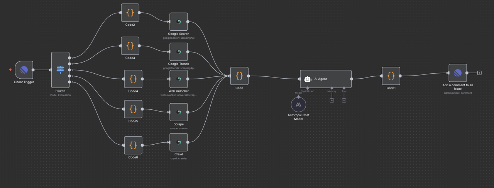
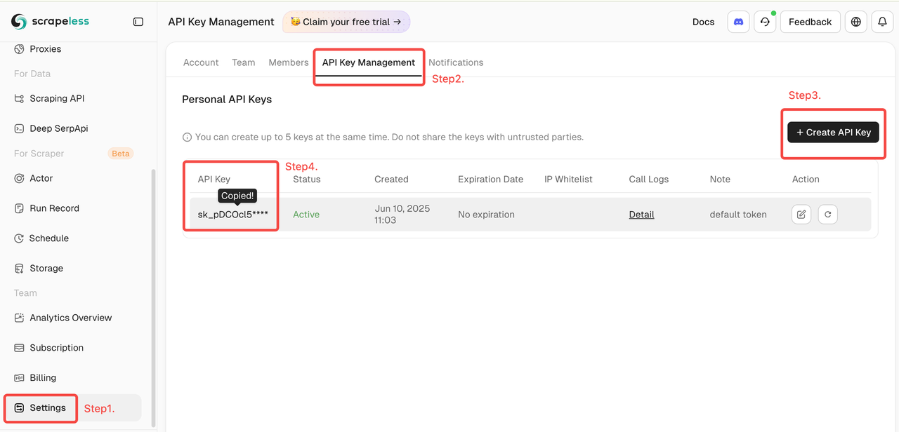
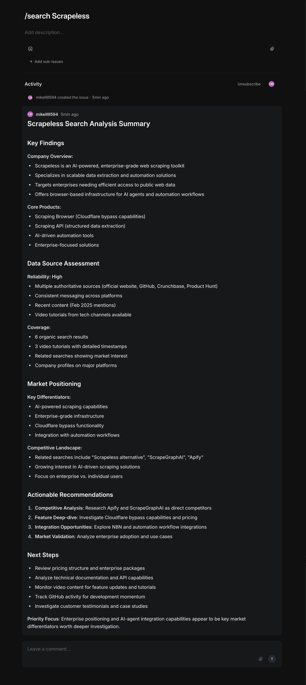

# Build an AI-Powered Research Assistant with Linear + Scrapeless + Claude

## Brief Overview

This workflow integrates Linear, Scrapeless, and Claude AI to create an AI research assistant that can respond to natural language commands and automatically perform market research, trend analysis, data extraction, and intelligent analysis.

Simply enter commands such as /search, /trends, /crawl in the Linear task, and the system will automatically perform search, crawling, or trend analysis operations, and return Claude AI's analysis results to Linear in the form of comments.

---

## How It Works

1. **Trigger**: A user creates or updates an issue in Linear and enters a specific command (e.g. /search competitor analysis).
2. **n8n Webhook**: Listens to Linear events and triggers automated processes.
3. **Command identification**: Determines the type of command entered by the user through the Switch node (search/trends/unlock/scrape/crawl).
4. **Data extraction**: Calls the Scrapeless API to perform the corresponding data crawling task.
5. **Data cleaning and aggregation**: Use Code Node to unify the structure of the data returned by Scrapeless.
6. **Claude AI analysis**: Claude receives structured data and generates summaries, insights, and recommendations.
7. **Result writing**: Writes the analysis results to the original issue as comments through the Linear API.

---

## Features

**Multiple commands supported**

- /search: Google SERP data query
- /trends: Google Trends trend analysis
- /unlock: Unlock protected web content (JS rendering)
- /scrape: Single page crawling
- /crawl: Whole site multi-page crawling

**Claude AI intelligent analysis**

- Automatically structure Scrapeless data
- Generate executable suggestions and trend insights
- Format optimization to adapt to Linear comment format

**Complete automation process**

- Codeless process management based on n8n
- Multi-channel parallel logic distribution + data standardization processing
- Support custom API Key, regional language settings and other parameters

---

## Requirements

- **Scrapeless API Key**: Scrapeless Service request credentials.
  - [Log in](https://app.scrapeless.com/passport/login?utm_source=github&utm_medium=n8n-integration&utm_campaign=ai-powered-research-assistant) to the Scrapeless Dashboard
  - Then click "**Setting**" on the left -> select "**API Key Management**" -> click "**Create API Key**". Finally, click the API Key you created to copy it. 
- **n8n Instance**: Self-hosted or n8n.cloud account.
- **Claude AI**: Anthropic API Key (Claude Sonnet 3.7 model recommended)

---

## Installation

1. Log in to Linear and get a Personal API Token
2. Log in to n8n Cloud or a local instance
3. Import the n8n workflow JSON file provided by Scrapeless
4. Configure the following environment variables and credentials:
   - Linear API Token
   - Scrapeless API Token
   - Claude API Key
5. Configure the Webhook URL and bind to the Linear Webhook settings page

---

## Usage

This automated job finder agent is ideal for:

| **Industry / Role**               | **Use Case**                                                                                       |
| --------------------------------- | -------------------------------------------------------------------------------------------------- |
| **SaaS / B2B Software**           |                                                                                                    |
| Market Research Teams             | Analyze competitor pricing pages using /unlock, and feature pages via /scrape.                     |
| Content & SEO                     | Discover trending keywords and SERP data via /search and /trends to guide content topics.          |
| Product Managers                  | Use /crawl to explore product documentation across competitor sites for feature benchmarking.      |
| **AI & Data-Driven Teams**        |                                                                                                    |
| AI Application Developers         | Automate info extraction + LLM summarization for building intelligent research agents.             |
| Data Analysts                     | Aggregate structured insights at scale using /crawl + Claude summarization.                        |
| Automation Engineers              | Integrate command workflows (e.g., /scrape, /search) into tools like Linear to boost productivity. |
| **E-commerce / DTC Brands**       |                                                                                                    |
| Market & Competitive Analysts     | Monitor competitor sites, pricing, and discounts with /unlock and /scrape.                         |
| SEO & Content Teams               | Track keyword trends and popular queries via /search and /trends.                                  |
| **Investment / Consulting / VC**  |                                                                                                    |
| Investment Analysts               | Crawl startup product docs, guides, and support pages via /crawl for due diligence.                |
| Consulting Teams                  | Combine SERP and trend data (/search, /trends) for fast market snapshots.                          |
| **Media / Intelligence Research** |                                                                                                    |
| Journalists & Editors             | Extract forum/news content from platforms like HN or Reddit using /scrape.                         |
| Public Opinion Analysts           | Monitor multi-source keyword trends and sentiment signals to support real-time insights.           |

---

## Output

## Resources

- [n8n workflow template](./workflow-template.json)
