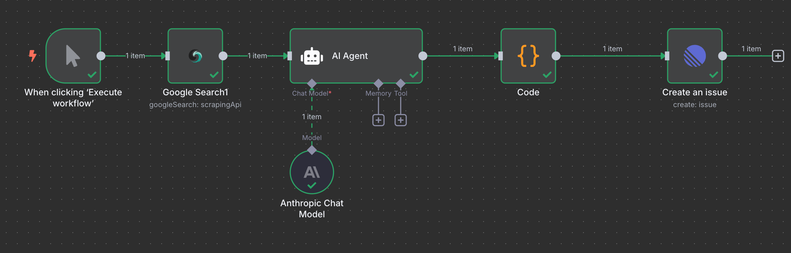
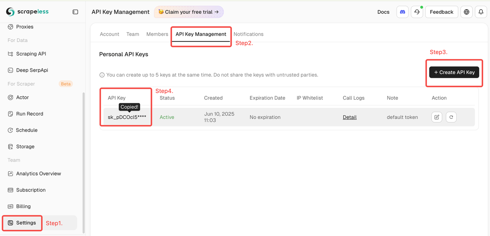
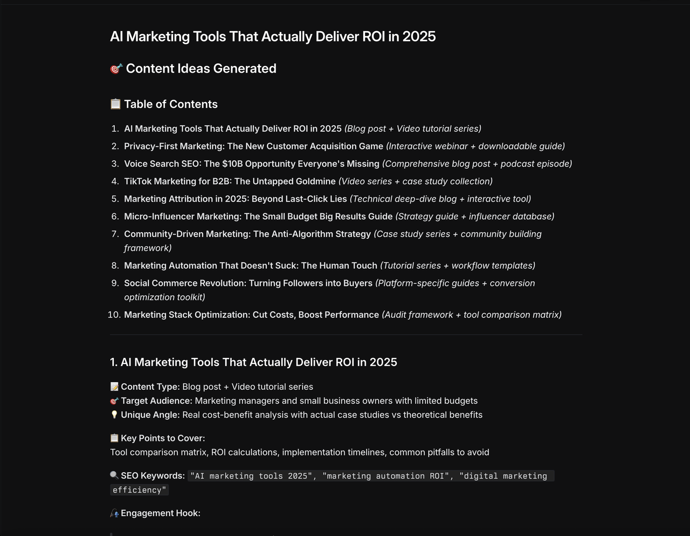

# Automated Content Idea Generator

## Brief Overview

This automation helps content creators effortlessly generate trending content ideas by combining Google search trends with AI analysis. Using Scrapeless to scrape Google trends, Claude AI to analyze and generate actionable ideas, and Linear for task management, this zero-code workflow delivers fresh, relevant content inspirations on demand.

---

## How It Works

- **Manual Trigger**: Generate content ideas instantly whenever inspiration is needed.
- **Google Search Trends**: Scrapeless searches targeted keywords to capture the latest industry hot topics.
- **AI-Powered Idea Generation**: Claude AI transforms search data into 10 unique, actionable content ideas.
- **Content Parsing**: Code nodes format the AI output for Linear integration.
- **Save to Linear**: Ideas are automatically created as organized tasks in your Linear project workspace.

---

## Features

- Automated trend discovery and competitor analysis
- AI-generated unique angles and detailed content plans
- Seamless integration with Linear for team collaboration
- Customizable keywords and industries for broad applicability

---

## Requirements

- Scrapeless API Key: Scrapeless Service request credentials.
  - [Log in](https://app.scrapeless.com/passport/login?utm_source=github&utm_medium=n8n-integration&utm_campaign=automated-content-idea-generator) to the Scrapeless Dashboard
  - Then click "**Setting**" on the left -> select "**API Key Management**" -> click "**Create API Key**". Finally, click the API Key you created to copy it. 
- n8n account (cloud or self-hosted)
- Claude AI API Key (Anthropic)
- Linear workspace and team access

---

## Installation

1. **Deploy n8n**: Self-hosted or cloud.
2. **Import Workflow**: Upload the JSON file to your n8n workspace.
3. **Add Scrapeless API Key**: Create and connect your API key in n8n.
4. **Connect Claude AI**: Add your Anthropic Claude API key.
5. **Connect Linear**: Create a Linear API key and link it in n8n.
6. **Configure Parameters**: Set your search keywords and Linear project settings.
7. **Run & Test**: Trigger the workflow and check that content ideas appear in Linear.

---

## Usage

This automated content idea generator is ideal for:

| **Industry / Role**  | **Use Case**                                                              |
| -------------------- | ------------------------------------------------------------------------- |
| **Content Creators** | Quickly obtain trending, niche-specific ideas to overcome writer’s block. |
| **Marketing Teams**  | Plan marketing campaigns, blogs, videos with fresh ideas.                 |
| **SEO Specialists**  | Identify trending keywords and topics to boost rankings.                  |
| **Content Agencies** | Batch-produce content proposals efficiently.                              |
| **Product Managers** | Stay updated on market trends to guide content strategy.                  |

---

## Output

## Resources

- [n8n workflow template](./workflow-template.json)
