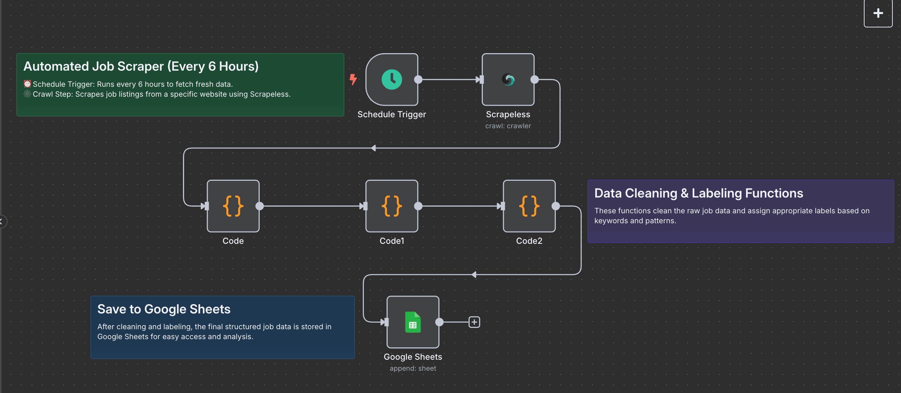
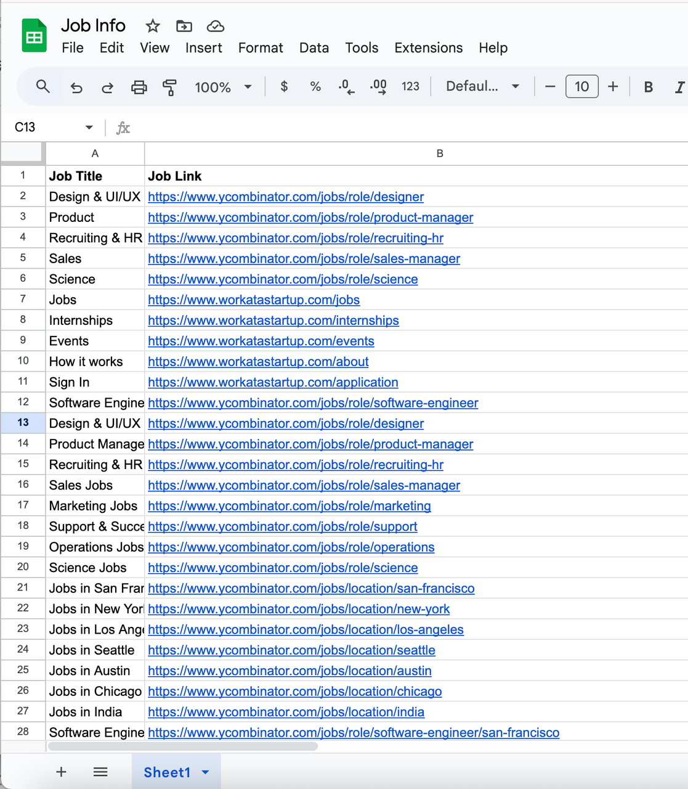

# Automated Job Finder Agent

## Brief Overview

This automation template helps you track the latest job listings from the Y Combinator Jobs page. By using Scrapeless to scrape job listings, n8n to orchestrate the workflow, and Google Sheets to store the results, you can build a zero-code job tracking solution that runs automatically every 6 hours.

---

## How It Works

1. **Trigger on a Schedule**: Every 6 hours, the workflow kicks off automatically.
2. **Scrape Job Listings**: Scrapeless crawls the Y Combinator Jobs page and returns structured Markdown data.
3. **Extract & Parse Content**: JavaScript nodes process the Markdown to extract job titles and links.
4. **Flatten Data**: Each job becomes a single row with its title and link.
5. **Save to Google Sheets**: New job listings are appended to your Google Sheet for easy viewing and sharing.

---

## Features

- No-code, automated job listing scraper.
- Scrapes and structures the latest Y Combinator job posts.
- Saves data directly to Google Sheets.
- Easy to schedule and run without manual effort.
- Extensible: Add Telegram, Slack, or email notifications easily in n8n.

---

## Requirements

- **Scrapeless API Key**: Scrapeless Service request credentials.
  - [Log in](https://app.scrapeless.com/passport/login?utm_source=github&utm_medium=n8n-integration&utm_campaign=job-finder-agent) to the Scrapeless Dashboard
  - Then click "**Setting**" on the left -> select "**API Key Management**" -> click "**Create API Key**". Finally, click the API Key you created to copy it. 
- **n8n Instance**: Self-hosted or n8n.cloud account.
- **Google Account**: For Google Sheets API access.
- **Target Site**: This template is designed for the [Y Combinator Jobs page](https://www.ycombinator.com/jobs) but can be modified for other job boards.

---

## Installation

1. Deploy n8n on your preferred platform.
2. Import this workflow JSON file into your n8n workspace.
3. Create and add your Scrapeless API Key in n8n’s credential manager.
4. Connect your Google Sheets account in n8n.
5. Update the target Google Sheet document URL and sheet name.

---

## Usage

This automated job finder agent is ideal for:

| **Industry / Role**               | **Use Case**                                                                        |
| --------------------------------- | ----------------------------------------------------------------------------------- |
| **Job Seekers**                   | Automatically track newly posted startup jobs without manually visiting job boards. |
| **Recruitment Agencies**          | Monitor YC job postings and build a candidate-job matching system.                  |
| **Startup Founders / CTOs**       | Stay aware of which startups are hiring, for networking and market insights.        |
| **Tech Media & Bloggers**         | Aggregate new job listings for newsletters, blogs, or social media sharing.         |
| **HR & Talent Acquisition Teams** | Monitor competitors’ hiring activity.                                               |
| **Automation Enthusiasts**        | Example use case for learning web scraping + automation + data storage.             |

---

## Output

## Resources

- [n8n workflow template](./workflow-template.json)
