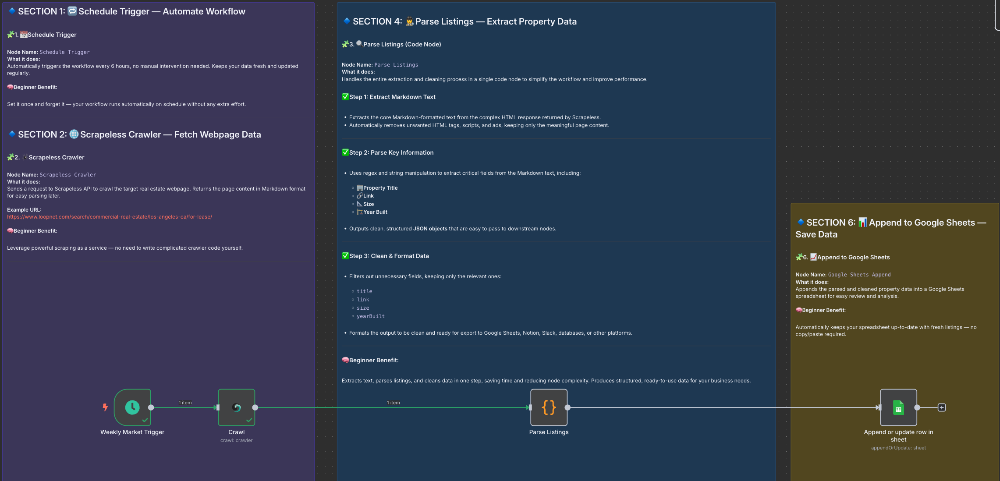
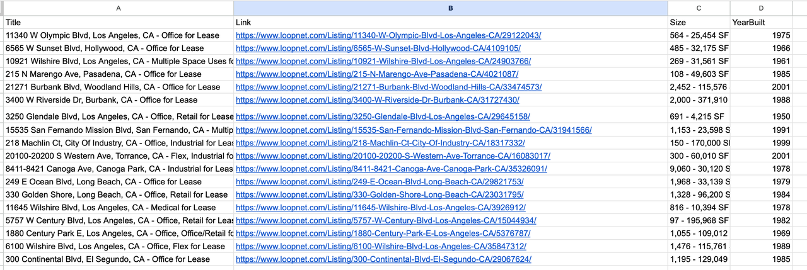

# Automated Real Estate Listing Scraper

## Brief Overview

This automation template helps you track the latest real estate listings from the LoopNet platform. By using Scrapeless to scrape property listings, n8n to orchestrate the workflow, and Google Sheets to store the results, you can build a no-code real estate data pipeline that runs automatically on a weekly schedule.

---

## How It Works

1. **Trigger on a Schedule**: The workflow runs automatically every week (can be adjusted to every 6 hours, daily, etc.).
2. **Scrape Property Listings**: crapeless crawls the LoopNet real estate website and returns structured Markdown data.
3. **Extract & Parse Content**: JavaScript nodes use regex to parse property titles, links, sizes, year built from Markdown.
4. **Flatten Data**: Each property listing becomes a single row with structured fields.
5. **Save to Google Sheets**: Property data is appended to your Google Sheet for easy analysis, sharing, and reporting.

---

## Features

- No-code, automated real estate listing scraper.
- Scrapes and structures the latest commercial property listings (for sale or lease).
- Saves structured listing data directly to Google Sheets.
- Fully automated, scheduled scraping—no. No manual scraping is required.
- Extensible: Add filters, deduplication, Slack/Email notifications, or multi-city scraping.

---

## Requirements

- **Scrapeless API Key**: Scrapeless Service request credentials.
  - [Log in](https://app.scrapeless.com/passport/login?utm_source=github&utm_medium=n8n-integration&utm_campaign=job-finder-agent) to the Scrapeless Dashboard
  - Then click "**Setting**" on the left -> select "**API Key Management**" -> click "**Create API Key**". Finally, click the API Key you created to copy it. 
- **n8n Instance**: Self-hosted or n8n.cloud account.
- **Google Account**: For Google Sheets API access.
- **Target Site**: This template is configured for LoopNet real estate listings but can be adapted for other property platforms like Crexi.

---

## Installation

1. Deploy n8n on your preferred platform.
2. Install the Scrapeless node from the community marketplace.
3. Import this workflow JSON file into your n8n workspace.
4. Create and add your Scrapeless API Key in n8n’s credential manager.
5. Connect your Google Sheets account in n8n.
6. Update the target LoopNet URL and Google Sheet details.

---

## Usage

This automated job finder agent is ideal for:

| **Industry / Role**        | **Use Case**                                                                           |
| -------------------------- | -------------------------------------------------------------------------------------- |
| **Real Estate Agencies**   | Monitor new commercial properties in target regions, and streamline lead generation.   |
| **Market Research Teams**  | Track market dynamics and property availability in real-time.                          |
| **BI/Data Analysts**       | Automate data collection for dashboards and commercial property insights.              |
| **Investors**              | Keep tabs on the latest investment opportunities in the commercial real estate market. |
| **Automation Enthusiasts** | Practical project for learning web scraping + automation + data pipelines.             |

---

## Output

## Resources

- [n8n workflow template](./workflow-template.json)
